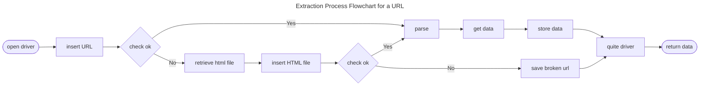

# **CAASES**

[](https://www.python.org/downloads/)  [](https://www.gnu.org/licenses/mit)

CAASES is a web crawler created for extracting accessibility information from websites through the [Avaliador e Simulador de Acessibilidade em Sítios (ASES)](https://asesweb.governoeletronico.gov.br/)

The collected information includes:

## Page Info

|    Variable         | Description | Dtype |
|---------------------|-------------|-------|
| `url`               | URL of the web page	 | string |
| `name`              | The title of the web page | string |
| `size_bytes`        | The size of the page's HTML file in bytes | float |
| `with_html`         | Indicates whether information was collected from the HTML file or the URL | boolean |
| `num_lines_of_code` | The number of lines of code in the web page | integer |

## Errors/Warnings Summary

The accessibility summary based on [eMAG](https://emag.governoeletronico.gov.br/) recommendations presents errors and warnings for six evaluation sections: **markup**, **behavior**, **content/information**, **presentation/design**, **multimedia** and **forms**.

| Variable              | Description              | Dtype   |
|-----------------------|--------------------------|---------|
| `url`                 | URL of the web page	 | STRING  |
| `ases_pct`            | Web page accessibility percentage | float |
| `n_markup_errors`     | Number of markup errors on the page | integer |
| `n_behavior_errors`   | Number of behavior errors on the page | integer |
| `n_information_errors`| Number of information errors on the page | integer |
| `n_presentation_errors`| Number of presentation errors on the page | integer |
| `n_multimedia_errors` | Number of multimedia errors on the page | integer |
| `n_form_errors`       | Number of form errors on the page | integer |
| `n_markup_warnings`   | Number of markup warnings on the page | integer |
| `n_behavior_warnings` | Number of behavior warnings on the page | integer |
| `n_information_warnings`| Number of information warnings on the page | integer |
| `n_presentation_warnings`| Number of presentation warnings on the page | integer |
| `n_multimedia_warnings` | Number of multimedia warnings on the page | integer |
| `n_form_warnings`     | Number of form warnings on the page | integer |

## Errors/Warnings eMAG

| Variable           | Description       | Dtype       |
|--------------------|-------------------|-------------|
| `url`              | URL of the web page	 | string |
| `category`         | Category of the content (`mark`, `behavior`, `information`, `presentation`, `multimedia`, `form`) | string |
| `info_type`        | Type of information (`error` or `warning`) | string |
| `recommendation`   | eMAG recommendation | string |
| `count`            | Quantity of recommendations | integer |
| `source_code_lines`| Lines of code to which the recommendation applies | list(string) |

## Installation & File Tree

CAASES can be installed directly from the source using the following commands

```bash
git clone https://github.com/lincprog/CAASES.git
pip install -r requirements.txt
```

The project structure is defined as follows:
```
📦crawler-docker
 ┣ 📂data  (data collected by the crawler. It includes the data explained above)
 ┃ ┣ 📜emag_summary.csv
 ┃ ┣ 📜err_warn_summary.csv
 ┃ ┗ 📜page_info.csv
 ┣ 📂html_files  (store HTML files downloaded by the crawler)
 ┣ 📂logs  (store log files generated by the crawler)
 ┣ 📜broken_urls.txt  (contains a list of broken URLs encountered during execution)
 ┣ 📜docker-compose.yml (Docker Compose configuration file)
 ┣ 📜main.py  (executing the crawling process)
 ┣ 📜models.py  (definitions for structures used for data collection)
 ┣ 📜README.md
 ┣ 📜requirements.txt  (dependencies required for the project)
 ┣ 📜urls.txt  (a list of URLs to be processed by the crawler)
 ┗ 📜utils.py  (utility functions and helper methods used throughout the project)
```

## Usage

**Please, ensure [Docker](https://www.docker.com/products/docker-desktop/) is installed on your system.**

1. Navigate to the directory containing the `docker-compose.yaml` file.
2. Open a terminal window.
4. Run the command below to start the Docker containers defined in the docker-compose.yaml file
```bash
docker-compose up -d
```
5. Once the containers are running, navigate to the directory containing the **main\.py** file.
6. Execute the **main\.py** file using the appropriate command for your Python environment
```bash
python main.py
```

Optionally, to monitor the execution in the Selenium Grid, you can access the URL in your browser at http://localhost:4444.

## Flowchart

